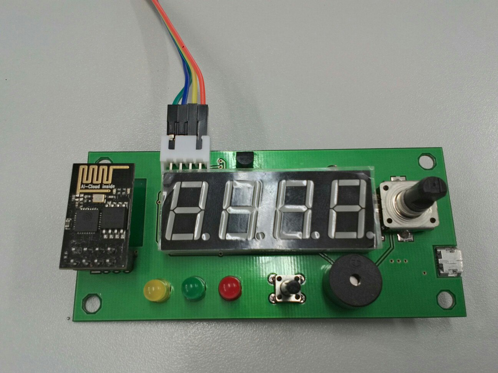
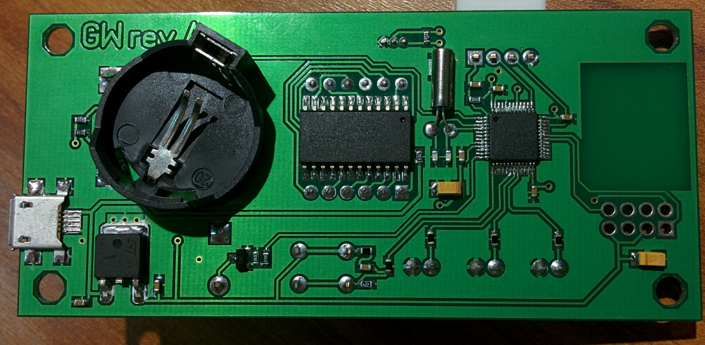

STM32 wifi_clock
===================

:star: &#128077;

Версия для ознакомления [Сайт](http://gatewelleducation.com/)

**Светодиоды** - порт B, pin 0, 1 & 2

**Кнопка** - порт A pin 3

**Что есть:**
- wi-fi
- датчик температуры
- динамик
